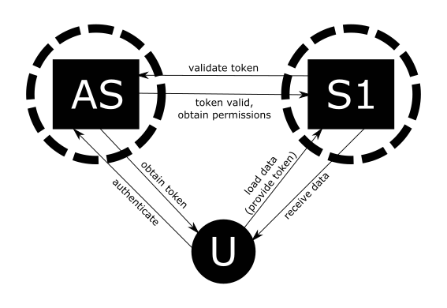
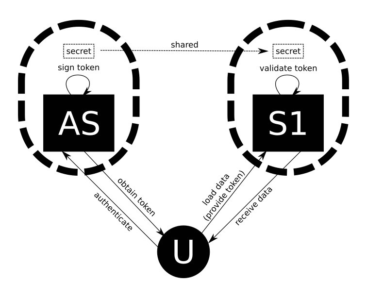
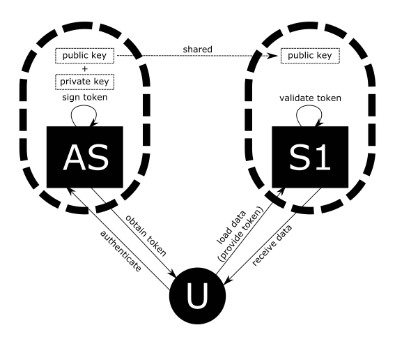

# Asymmetric JWT

## Deployment Scenarios

The following setup is particularly well suited for a microservices environment, where you have one or more authentication services servicing a suite of various microservices. The scenario is that users (or your UI application) log in with the authentication service and obtain a token. From this moment on, users will need to include that token in requests made to all other services in the system to confirm their identity. But this means that the other services in your system need to be able to verify that the provided token is valid and the details contained in it are correct. There are several scenarios to ensure this.



The first approach is to have other services collaborate with the authentication service for each token they see. They send a request with the token to the authentication service, the authentication service verifies the token signature and replies with confirmation if the toke is valid. If you have a combined authentication/authorization service, this response can also provide the permissions associated with this token. The advantage to this approach is that you have a single service that has the signing key, kept secret. But a big disadvantage is the continuous traffic that is necessary in your system. For every request made to one of the services in your system, that service needs to send a request to the authentication service and wait for the reply before it can do its work. Your authentication service is a single point of failure, and if it were that the service is going offline for a while, all the system will be blocked.



An improvement on the previous approach is to give all your services the functionality to verify the token signature themselves. When a service receives the token it can verify the token signature using the secret key and if the token is proper, the service can continue with its work. If you have a shared authentication/authorization service, a JWT token can contain any details you need in the payload, so your authentication/authorization service can include the permissions of the authenticated users when creating the token. A big advantage is there is no more need of tight coupling between the authentication service and all your other services. If you need to take your authentication service offline for a little while, the authenticated users can still use the rest of the services. But a big problem here is that you need to share the secret key. Every service on the system needs a copy of the key, if every service is deployed on a separate machine you need a copy of that key on every machine, you need to protect access to the whole production environment. If one service on your system is compromised, the whole system is compromised, the attacker can use the shared secret to generate their own tokens and imperonate anyone they want in your system. There is a better way.



The third proposed solution combines the advantages of both previous solutions. This approach uses an asymmetric key. The authentication service uses the private key to sign the token, but the signature can be verified with the public key. All other services in the system need a copy of the public key, but this copy does not need to be protected. The only thing the public key can be used for is to verify token signatures. The public key can't be used to sign a token and impersonate another user in the system. The only sensitive machine in your system is the authorization service, which has the private key.

## Implementation

### Generating the Keys

Generate the public-private key pair with Java's keytool.

```
keytool -genkeypair -alias jwtkey -keyalg RSA -dname "CN=asyjwt;OU=asyjwt;O=cacoveanu;L=Town;S=State,C=Country" -keypass obscureKeyPassword -keystore jwt_pair_store.jks -storepass obscureStorePassword
```

Then export the public key to its separate file.

```
keytool -export -keystore jwt_pair_store.jks -alias jwtkey -file public_jwt_key.cer
```

You will be asked for the store password. The end result is two files. The first, `jwt_pair_store.jks`, containing the public and private keys, which will reside on the machine running the authorization service. The second, `public_jwt_key.cer` is you public key, which you are free to distribute to all the machines that run services which need to validate the tokens generated by the authorization service.

### Java authorization service

The authorization service is implemented in Java, using Spring Boot and the [jjwt](https://github.com/jwtk/jjwt) library, and I will present snipets of it here. The authorization service is built as an API that provides authorization related functionality, mainly user login, but other user-related operations, like assigning rights to users.

The service expects tokens to be present on request headers to perform authorized operations. The only operation where no token is necessary is the login operation. In the case of login, username and password should be present in the body of the login, and the application will verify the credentials and generate a token if they are correct. The token will be returned as a header of the response.

``` java
@Configuration
@EnableWebSecurity
public class WebSecurityConfig extends WebSecurityConfigurerAdapter {

    @Autowired
    private LocalAuthenticationProvider localAuthenticationProvider;

    @Autowired
    private UserService userService;

    @Autowired
    private TokenAuthenticationService tokenAuthenticationService;

    @Override
    protected void configure(HttpSecurity http) throws Exception {
        http.sessionManagement()
                .sessionCreationPolicy(SessionCreationPolicy.STATELESS);

        http.csrf().disable().authorizeRequests()
                .antMatchers("/").permitAll()
                .antMatchers(HttpMethod.POST, "/login").permitAll()
                .antMatchers("/users/**").hasAuthority("ADMIN")
                .antMatchers("/permissions/**").hasAuthority("ADMIN")
                .anyRequest().authenticated()
                .and()
                .addFilterBefore(new JWTLoginFilter("/login", authenticationManager(), tokenAuthenticationService),
                        UsernamePasswordAuthenticationFilter.class)
                .addFilterBefore(new JWTAuthenticationFilter(tokenAuthenticationService),
                        UsernamePasswordAuthenticationFilter.class);
    }

    @Override
    protected void configure(AuthenticationManagerBuilder auth) throws Exception {
        auth.authenticationProvider(localAuthenticationProvider);
    }
}
```

The `WebSecurityConfig` class is a Spring configuration class that sets up the access necessary for different URLs of the API: access to `/login` for all, access to `/users` or `/permissions` only if the token on the request header has admin rights. Two request filters are also added, `JWTLoginFilter` will handle the login functionality and generate a token, and it applies only to the `/login` path, and the `JWTAuthenticationFilter` will verify all requests for the presence of the token and validate the received token before allowing access to the invoked API endpoints.

``` java
public class JWTLoginFilter extends AbstractAuthenticationProcessingFilter {

    private TokenAuthenticationService tokenAuthenticationService;

    public JWTLoginFilter(String url, AuthenticationManager authManager,
                          TokenAuthenticationService tokenAuthenticationService) {
        super(new AntPathRequestMatcher(url));
        setAuthenticationManager(authManager);
        this.tokenAuthenticationService = tokenAuthenticationService;
    }

    @Override
    public Authentication attemptAuthentication(HttpServletRequest req, HttpServletResponse res)
            throws AuthenticationException, IOException {
        AccountCredentials credentials = new ObjectMapper()
                .readValue(req.getInputStream(), AccountCredentials.class);
        return getAuthenticationManager().authenticate(
                new UsernamePasswordAuthenticationToken(
                        credentials.getUsername(),
                        credentials.getPassword(),
                        Collections.emptyList()
                )
        );
    }

    @Override
    protected void successfulAuthentication(
            HttpServletRequest req,
            HttpServletResponse res, FilterChain chain,
            Authentication auth) {
        tokenAuthenticationService
                .addAuthentication(res, auth.getName(), auth.getAuthorities());
    }
}
```

As can be seen above, in the `JWTLoginFilter`, if the user is trying to access the `/login` URL, an attempt is made to read credentials from the request input stream. Next, the authentication manager is invoked to verify if those credentials are valid. An `Authentication` object is returned, containing the user and the permissions of the users, also calle authorities, if the authentication was successful. A second method, `successfulAuthentication`, is responsible with generating and adding the token to the response, but the token authentication services is actually referred to to achieve that.

The `AccountCredentials` that the `JWTLoginFilter` expects are of the following form:

``` java
public class AccountCredentials {

    private String username;
    private CharSequence password;

    public String getUsername() {
        return username;
    }

    public void setUsername(String username) {
        this.username = username;
    }

    public CharSequence getPassword() {
        return password;
    }

    public void setPassword(CharSequence password) {
        this.password = password;
    }
}
```

``` java
@Component
public class LocalAuthenticationProvider implements AuthenticationProvider {

    @Autowired
    private UserService userService;

    @Autowired
    private PasswordEncoder passwordEncoder;

    @Override
    public Authentication authenticate(Authentication authentication) throws AuthenticationException {
        String name = authentication.getName();
        Object password = authentication.getCredentials();

        if (isCorrect(name, password)) {
            return new UsernamePasswordAuthenticationToken(name, password, userService.getPermissions(name));
        } else {
            return null;
        }
    }

    private boolean isCorrect(String name, Object password) {
        Optional<User> userOptional = userService.loadUser(name);
        if (userOptional.isPresent()) {
            User user = userOptional.get();
            return passwordEncoder.matches((CharSequence) password, user.getPasswordHash());
        }
        return false;
    }

    @Override
    public boolean supports(Class<?> authentication) {
        return authentication.equals(UsernamePasswordAuthenticationToken.class);
    }
}
```

The implementation of the `AuthenticationProvider`, the `LocalAuthenticationProvider`, is responsible with verifying user names and password hashes against the users database. The `userService` is actually used to acces the database and load the user and password hash. If the credentials are correct, the permissions for the current user are also loaded from the `userService`. Permission objects are implementations of the `GrantedAuthority` interface, which means they implement a method named `getAuthority` which returns a string representation of that permission. For the administrator permission, for example, this string representation could be `ADMIN`. If you are building an application where users can have read and write permissions for different resources, a read permission for resource 1 could be serialized to string as `READ_resource1`. What form you use is up to your implementation, the only consideration to take into account is that the string form should have all the necessary information to make decisions about allowing access to resources without having to query the database again.

Continuing with our implementation of the `JWTLoginFilter`, the last step once the user has been logged in successfully and their permissions loaded is to generate the JWT token containing all this information, and this is done with the `TokenAuthenticationService`:

``` java
@Service
public class TokenAuthenticationService {

    private static Logger logger = LoggerFactory.getLogger(TokenAuthenticationService.class);


    @Value("${security.keyStorePath}")
    private String keyStorePath;

    @Value("${security.keyStorePassword}")
    private char[] keyStorePassword;

    @Value("${security.keyPassword}")
    private char[] keyPassword;

    @Value("${security.keyAlias}")
    private String keyAlias;

    private Key privateKey;

    private PublicKey publicKey;

    @PostConstruct
    public void init() {
        try {
            KeyStore keyStore = KeyStore.getInstance(KeyStore.getDefaultType());
            keyStore.load(new FileInputStream(keyStorePath), keyStorePassword);
            privateKey = keyStore.getKey(keyAlias, keyPassword);
            publicKey = keyStore.getCertificate(keyAlias).getPublicKey();
        } catch (Throwable t) {
            logger.error("failed to initialize jwt keys!", t);
        }
    }

    /* ... */
}
```

First, you will see the init method, which reads the key store on the disk and loads the private and public keys in memory.

``` java
@Service
public class TokenAuthenticationService {

    /* ... */

    private static final String PERMISSIONS_CLAIMS_KEY = "permissions";
    private static final String TOKEN_PREFIX = "Bearer";
    private static final String HEADER_STRING = "Authorization";

    @Value("${security.expirationMilliseconds}")
    private Long expirationTime = null;

    public void addAuthentication(HttpServletResponse res, String username, Collection<? extends GrantedAuthority> authorities) {
        String JWT = Jwts.builder()
                .setSubject(username)
                .setExpiration(new Date(System.currentTimeMillis() + expirationTime))
                .addClaims(getPermissionsClaim(authorities))
                .signWith(privateKey, SignatureAlgorithm.RS512)
                .compact();
        res.addHeader(HEADER_STRING, TOKEN_PREFIX + " " + JWT);
    }

    private Map<String, Object> getPermissionsClaim(Collection<? extends GrantedAuthority> authorities) {
        HashMap<String, Object> claims = new HashMap<>();
        claims.put(
                PERMISSIONS_CLAIMS_KEY,
                authorities.stream()
                        .map(a -> a.getAuthority())
                        .collect(Collectors.toList())
        );
        return claims;
    }

    /* ... */
}
```

The `addAuthentication` method uses the [jjwt](https://github.com/jwtk/jjwt) library to generate a JWT token containing the user name, an expiration date, and a list of permissions. This token is added as a header to the response.

### Java Token Validation

Now that the login flow has been reviewed, we'll look at the token validation flow, in the context of the same authorization service. Since the authorization service will also provide functionality other than the login, and access to that functionality needs to be restricted, the authorization service needs to have a way of validating tokens it receives, and it does this just like any other microservice in your echosystem would do, using the public key.

``` java
public class JWTAuthenticationFilter extends GenericFilterBean {

    private TokenAuthenticationService tokenAuthenticationService;

    public JWTAuthenticationFilter(TokenAuthenticationService authenticationService) {
        this.tokenAuthenticationService = authenticationService;
    }

    @Override
    public void doFilter(ServletRequest request,
                         ServletResponse response,
                         FilterChain filterChain)
            throws IOException, ServletException {
        Authentication authentication = tokenAuthenticationService
            .getAuthentication((HttpServletRequest) request);

        SecurityContextHolder.getContext()
            .setAuthentication(authentication);
            
        filterChain.doFilter(request,response);
    }
}
```

A different filter is used to intercept requests and verify if they contain the relevant tokens, the `JWTAuthenticationFilter`. The `doFilter` method will use the `tokenAuthenticationService` to verify a request and obtain an `Authentication` object from it, which it will add to the security context of the current request.

``` java
@Service
public class TokenAuthenticationService {

    /* ... */

    public Authentication getAuthentication(HttpServletRequest request) {
        String token = request.getHeader(HEADER_STRING);
        if (token != null) {
            String user = null;
            List<GrantedAuthority> permissions = null;
            try {
                Claims body = Jwts.parser()
                        .setSigningKey(publicKey)
                        .parseClaimsJws(token.replace(TOKEN_PREFIX, ""))
                        .getBody();
                user = body.getSubject();
                permissions = parsePermissions((List<String>) body.get("permissions"));
            } catch (MalformedJwtException | ExpiredJwtException e) {
                logger.warn("failed to parse token", e);
                user = null;
            }

            if (user != null) {
                return new UsernamePasswordAuthenticationToken(user, null, permissions);
            }
        }
        return null;
    }

    private List<GrantedAuthority> parsePermissions(List<String> permissions) {
        return permissions.stream().map(s -> {
            /* parse string to granter authority */
        }).collect(Collectors.toList());
    }
}
```

In the `TokenAuthenticationService`, the token is read from the request header and, if it exists, the [jjwt](https://github.com/jwtk/jjwt) is used to verify if it is valid. In this validation use-case, the public key (read from the key store) is used. If the token is valid, it does not throw a `MalformedJwtException` or an `ExpiredJwtException`, we can read the user name and the user permissions from the token payload. We need a method to deserialize the permissions from string based on how those permissions look like. These are all returned as a `UsernamePasswordAuthenticationToken` object, which contains also the `GrantedAuthority` list, the list against which the Spring Boot security libraries validate if the user has the correct rights to access an API, as defined in the `WebSecurityConfig` class. Full circle.

### C# token validation (.net core)

As a bonus, I am also adding some C# code that can be used to validate and parse a token, this time based entirely on the public key. I am using the `System.IdentityModel.Tokens.Jwt` NuGet package to help with the token validation. The design is very similar to the Java application. We have a filter that intercepts requests, reads the token from the request header, uses the public key to validate the token, and if everything is valid it adds the user and permissions to the security context of the current request.

``` c#
public class ApiAuthorizationFilter : IAuthorizationFilter
{
    private ILogger logger = Log.ForContext<ApiAuthorizationFilter>();

    private AuthorizationSettings authorizationSettings;
    

    public ApiAuthorizationFilter(AuthorizationSettings authorizationSettings)
    {
        this.authorizationSettings = authorizationSettings;
    }

    public void OnAuthorization(AuthorizationFilterContext context)
    {
        if (!IsAllowedAccess(context))
        {
            context.Result = new UnauthorizedResult();
        }
    }

    /* ... */
}
```

We start by initializing the filter with some settings, the `AuthorizationSettings` only contains the location of the public certificate, and will be used later in this class. The `IAuthorizationFilter` interface has one method that we need to implement, `OnAuthorization`. If access is not allowed to the application, we create a new `UnauthorizedResult` and add it to the `AuthorizationFilterContext`.

``` c#
public class ApiAuthorizationFilter : IAuthorizationFilter
{
    /* ... */

    private bool IsAllowedAccess(AuthorizationFilterContext context)
    {
        StringValues headerValues = context.HttpContext.Request.Headers["Authorization"];
        if (headerValues.Count > 0)
        {
            string headerValue = headerValues.GetEnumerator().Current;
            string token = headerValue.Substring("Bearer ".Length);

            if (TokenIsValid(token))
            {
                return AuthorizationContext.Permissions.Count > 0;
            }
        }
        return false;
    }

    /* ... */
}
```

The `IsAllowedAccess` method reads the authorization header from the request and obtains the token. We then check if the token is valid. We have a special case here where the token may be valid, but no permissions are present on the token, in which case we still consider that we should not provide access to the API.

``` c#
public class ApiAuthorizationFilter : IAuthorizationFilter
{
    /* ... */

    private bool TokenIsValid(string token)
    {
        JwtSecurityTokenHandler handler = new JwtSecurityTokenHandler();
        SecurityToken validatedToken;
        try
        {
            var user = handler.ValidateToken(token, GetValidationParameters(), out validatedToken);
            if (user != null)
            {
                var permissions = user.Claims
                    .Where(c => c.Type == "permissions")
                    .Select(c => ParsePermission(c.Value))
                    .Where(p => p != null)
                    .ToList();
                AuthorizationContext.Permissions = permissions;
                return true;
            }
        } catch (Exception e)
        {
            logger.Warning(e, "failed to validate token");
        }
        return false;
    }

    private TokenValidationParameters tokenValidationParameters;

    private TokenValidationParameters GetValidationParameters()
    {
        if (tokenValidationParameters == null)
        {
            tokenValidationParameters = new TokenValidationParameters
            {
                ValidateLifetime = true,
                ValidateIssuer = false,
                ValidateAudience = false,
                IssuerSigningKey = new X509SecurityKey(
                    new System.Security.Cryptography.X509Certificates.X509Certificate2(
                        authorizationSettings.CertificatePath
                    )
                )
            };
        }
        return tokenValidationParameters;
    }

    private Permission ParsePermission(string str)
    {
        /* parse permission object from string */
    }
}
```

We finally get to the last leg of the journey, the `TokenIsValid` method. This is where we use a `JwtSecurityTokenHandler` to try and validate the token based on some `TokenValidationParameters`, the conditions under which the token is valid. The `GetValidationParameters` method will do lazy a initialization of the `TokenValidationParameters`. We are interested in vaidating that the token is not expired, the lifetime validation, and that the token has not been tampered with. This is where we read the public key from the certificate file and use it to validate the token signature.

If the token was correctly validated, the permissions in the token payload can be parsed and added to the security context. Further down the line, in controllers, the security context can be checked for the presence of specific permissions to further give or revoke access to some parts of the API.