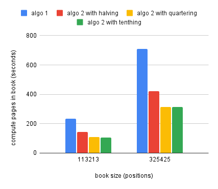
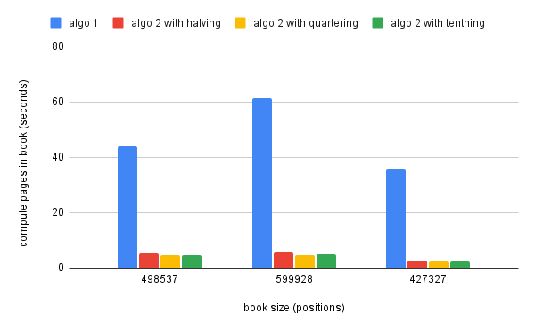

# Improving page computation in ebooks

How do you display an ebook on a web page? One way is to show the whole book
contents, with a scroll bar. For a better reading experience, you display one
page at a time, with buttons to turn the pages. How can you defined a book page
for a digital medium where the screen sizes will vary? A page is how much
content fits onto the current screen size without clipping, so without the need
for the user to scroll. And how do you find the individual pages of a book for a
specific screen size, font size, font face, border settings? And how do you
prepare for the situation when the user increases the font size or scales the
viewport? You cannot precompute pages, the only solution to have accurate pages
is to compute them on the fly. And to do that well, with minimal intreruptions
in the reading experience, you need an efficient algorithm.

This discussion is originating from a rework of my Chronic Reader progressive
web application where I try to do all the work of loading an EPUB file and
displaying it as a book directly in the user client, the web browser. The
original application design would unzip the book file and parse it into book
sections in the server application, and send those book sections to the UI. With
the new implementation, the server only provides the book archive bytes to the
client, and everything else is done in the browser. With this much more work
done in the client when opening a book, I had to revisit the original page
computation algorithm and improve it.

Following is the original algorithm. The `computeMaximalPage` function will
compute a page starting at the provided position. It will try to fit as much
book content in the page as possible. The way the algorithm achieves this is by
successively adding a word to the page, then checking to see if the web
component representing the page has exceeded its screen space with the
`overflowTriggerred` function. We are adding words because we don't want to
split them. Special elements that must be included whole on a page, like images
and tables, are considered to represent a single position in our book and the
`findSpaceAfter` method will know not to split their data.

``` js
async #computeMaximalPage(start) {
        let previousEnd = null;
        let end = await this.book.findSpaceAfter(start);
        this.shadowElement.innerHTML = "";

        while ((await this.#overflowTriggerred()) == false 
            && previousEnd != end && end != null) {

            previousEnd = end;
            end = await this.book.findSpaceAfter(previousEnd);
            let html = await this.book.getContentsAt(start, end);
            this.shadowElement.innerHTML = html;
        }
        if (previousEnd != null) {
            return new Page(start, previousEnd);
        } else {
            return new Page(start, start);
        }
    }
```

The first obvious problem with this algorithm is that we always start with one
word and keep adding words until we find our page. But we can infer that, for a
specific screen setup, a page would be of roughly the same size. There will be
exceptions, pages containing tables or images. But looking at the big picture,
we can expect to have roughly the same amount of characters on each page. We can
use this average number of characters as a starting point when computing the
page.

The second obvious problems is that we are always moving at the same pace when
computing a page, one word at a time. A more efficient pace would be to start
with a lot of words, keep adding many words to the page until we exceed our
space, then start decreasing the number of words we add until we find the right
page size. This improved algorithm is not unlike a gradient descent for page
size, with the number of words still fitting in the page as the slope of the
function that would give us the right amount of words for the current page. As
the slope gets flatter, decreases, we add fewer words until we find the maximum
accepted words on this page.

Following is the new algorithm for computing maximal page with the improvents
described above:

``` js
async #computeMaximalPage2(start) {
    let jumpStep = Math.floor(this.#getAveragePageSize() * .9);
    let minimumJumpStep = 10;
    let end = start;
    this.shadowElement.innerHTML = "";
    let resolved = false;

    do {
        let tryEnd = end + jumpStep;
        let newEnd = await this.book.findSpaceAfter(tryEnd, start);
        if (newEnd != null) {
            let contents = await this.book.getContentsAt(start, newEnd);
            if (contents != null) {
                this.shadowElement.innerHTML = contents;
                let overflow = await this.#overflowTriggerred();
                if (overflow == false) {
                    if (newEnd == end) {
                        // not making progress, we are probably at the end
                        resolved = true;
                    } else {
                        //we can keep looking
                        end = newEnd;
                    }
                } else {
                    if (jumpStep > 0) {
                        // readjust our computation
                        jumpStep = Math.floor(jumpStep / 4);
                        if (jumpStep < minimumJumpStep) jumpStep = 0;
                    } else {
                        // we have found the maximal page at the previous step
                        resolved = true;
                    }
                }
            } else {
                // null content is an issue and we should stop
                resolved = true;
            }
        } else {
            resolved = true;
        }
    } while (resolved == false);

    this.#updateAveragePageSize(end - start);
    return new Page(start, end);
}
```

The first thing that sticks out is that when intializing the jump step we are
only using 90% of the average page size. This is done because the algorithm is
not using the real average page size. We compute the average page size by adding
the current page size to the previous average and dividing by two, so we are not
computing a real average and the latest page can influence this number greatly.
We are also using a `minimumJumpStep`. If our jump step falls below this
minimum, we start adding single words to our page.

For every iteration of the algorithm, we are jumping over a number of characters
according to the current jump step, then we look for the word break after this
suggested end point, since we do not want to split words between pages. We then
add the contents and check if we have exceeded the page size. If we did not
exceed, we continue with the current jump step. If we exceeded the page size, we
need to adjust the jump step. This is another point of optimization, how fast do
we reduce the jump step? After several tests here a quartering of the jump step
seems to provide a good reduction approach.

We have several possible exit points. Some are in case of errors, if the content
is null or the suggested page end is null. On the valid exit paths, one is when
looking for a new end page candidate we get the same end position as at the
previous step. This means we have reached the end of a section or of the whole
book; there is no new end available, the one we have is where we must stop. The
second, and most often encountered, exit point is when we have triggered and
overflow and the jump step is zero. This is when we are in the last expansion
cycle, adding single words to the page, and we have just added a word that made
the page no longer fit on the screen. In this case, the previous end we have is
the correct end of the page.




The charts above present the performance improvement of the pages computation
for two classes of books. The left chart shows more complicated books, books
with a lot of images where we end up with very varied pages sizes based on image
dimensions. The right chart shows simpler books, usually only text. In both
cases we can see significant improvements between the old algorithm, `algo 1`,
and variations of the second algorithm. The variations for `algo 2` refer to the
speed with which the jump step is decreased when we are trigerring an overflow.
The performance difference between the three approaches is minimal, but a good
middle step seems to be to split the jump step by 4 when we need to reduce it.

As a conclusion, the performance improvement with the new algorithm will range
from a little over twice as fast for more complicated books, up to ten, even
fifteen times faster than the old algorithm for the simpler books. The entire
source code for this project can be found on
[github](https://github.com/chronicweirdo/chronicreaderlib).